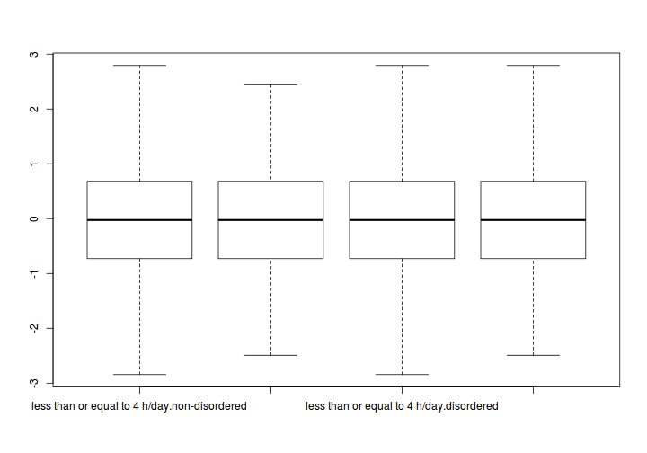
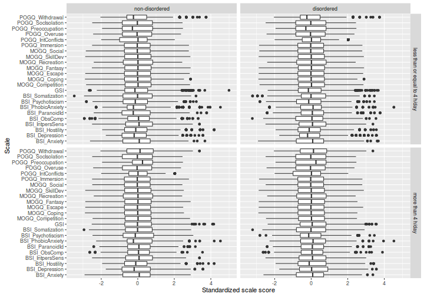
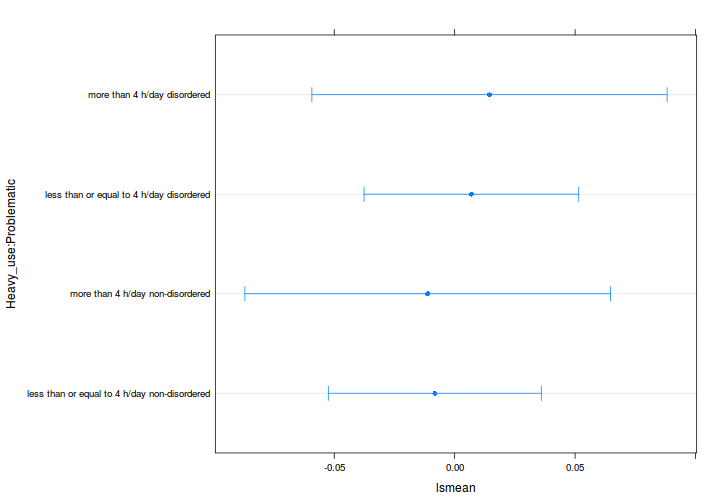
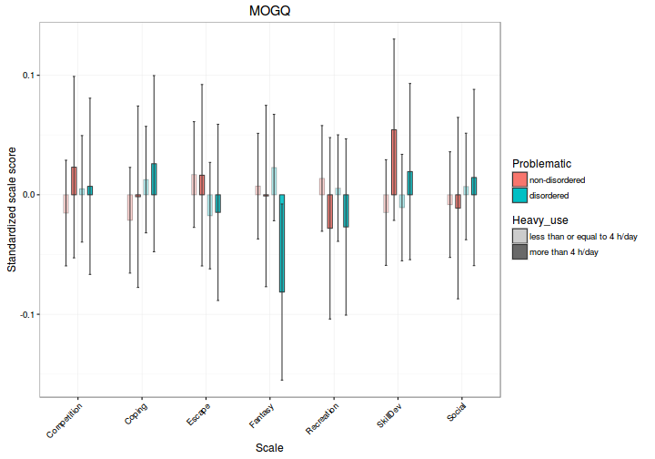
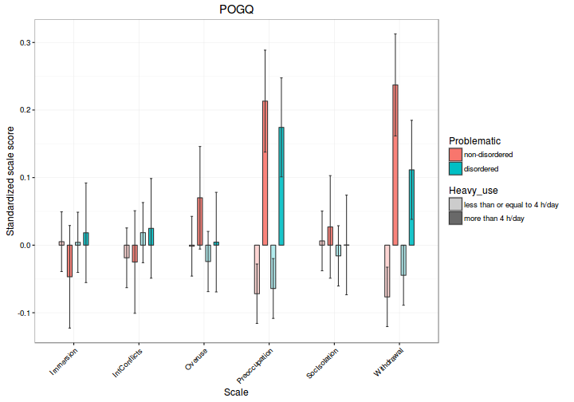
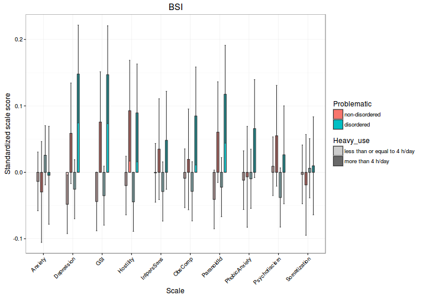

# Elemzés 


Miután az adatok előkészítését befejeztük, érdemes "tiszta lappal" indítani az elemzéseket. Ezt RStudio-ban egyszerűen megtehetjük úgy, hogy újra megnyitjuk a "gaming" nevű projektünket. Ekkor egy új R-session-t indítunk, ezáltal nem fordulhat elő, hogy az adatelőkészítés során létrehozott változók, vagy az akkor betöltött csomagok "összeakadnak" az adatelemzés során létrehozott változókkal vagy betöltött csomagokkal.

Az első lépésünk egyértelmű; töltsük be az előkészített adattáblát:

```r
model_dat <- readRDS(file.path("data", "prepared_data.rds"))
```

## Ellenőrző ábra

Mielőtt hozzákezdenénk az elemzéshez, képet kellene kapnunk arról, hogy az adatainkban nincsenek-e túlzottan kilógó értékek, nagyjából normális eloszlásúak-e a skálapontszámok az egyes alcsoportokban, illetve várható-e egyáltalán különbség a csoportátlagok között. Ezen célnak megfelelő vizualizációs forma például a boxplot ("doboz"-ábra).

[Korábban](../sec7_plotting/base.html) már láttuk, hogyan lehet egyszerűen boxplot-ot készíteni. Például az 'MOGQ_Social' változóra:

```r
boxplot(MOGQ_Social ~ Heavy_use * Problematic, data = model_dat)
```



Ugyanezt megismételhetnénk az összes többi skálapontszámra, de elegánsabb lenne az összes változót egyetlen ábrán megjeleníteni. Emlékezzünk rá, hogy a [lattice](../sec7_plotting/lattice.html) és [ggplot](../sec7_plotting/ggplot.html) csomagokkal könnyedén készíthetünk panelekre bontott ábrákat, ráadásul ezen csomagokkal (különösen a ggplot2-vel) egyszerű váltani az ábrázolási formák (pl. hisztogram, boxplot, scatterplot stb.) között. Ehhez azonban át kell alakítanunk a jelenlegi, "wide" formátumú adattáblánkat "long" formájúra:

```r
library(tidyr)
model_dat_long <- gather(model_dat, alskala, pontszam, 
                         -Sorszam, -Heavy_use, -Problematic)
```

Az átalakítás után az ábrázolás már nagyon egyszerű. Használjuk a *ggplot2* csomagot, 
és ábrázoljuk a skálapontszámok eloszlását, külön-külön a négy csoportban:

```r
library(ggplot2)
# ábrázolás (magyarázattal)
ggplot(model_dat_long,        # vedd a model_dat_long adattáblát
       aes(x = alskala, y = pontszam)) +  # az 'alskala' függvényében
                                          # ábrázold a mutató értékét
    geom_boxplot() +   # boxplot ábrázolást kérünk
    facet_grid(Heavy_use ~ Problematic) +  # tedd külön panelekbe
                             # a 'Heavy_use' és 'Problematic' szerint
                             # képzett csoportokat
    xlab("Scale") +    # x tengely felirata
    ylab("Standardized scale score") + # y tengely felirata 
                       # az áttekinthetőség miatt horizontális
                       # boxplot-ot kérünk, azaz cseréld fel az
    coord_flip()       # x és y tengelyeket
```



Az ábrák alapján jónéhány outlier személyünk van a mintában. A következőkben tekintsünk el ettől, és illesszünk ANOVA-modelleket az egyes skálapontszámokra.

## ANOVA-k futtatása

Emlékeztetőül: külön-külön ANOVA-t kell futtatnunk minden egyes skálapontszámra,
mégpedig magyarázó változóként a két csoportosító változónkat szerepeltetve. 

Először gondoljuk át, hogyan futtatnánk az elemzést akkor, ha csak egyetlen skálapontszámot modelleznénk. Használhatnánk például a [korábban ismertetett](../sec8_regr/ez.html) *ez* csomagot. Az *ez* csomag `ezANOVA()` függvénye azonban sokkal inkább alkalmas interaktív adatelemzésre, mint programozásra, mivel ebben a függvényben a változókat névvel, nem pedig karakteres formában kell megadni. A probléma ugyan haladó R-programozói szinten kikerülhető, ezúttal kényelmesebb a [korábban már reklámozott](../sec8_regr/ez.html) *afex* csomagot használnunk.

```r
library(afex)
```

Az *afex* csomag `aov_ez` függvénye gyakorlatilag megfeleltethető az *ez* csomag `ezANOVA()` függvényének, de itt a változók neveit karaktervektorként kell megadnunk. A függvény elvár egy személyi azonosítót is, ezt készítsük el a 'Sorszam' változóból:

```r
model_dat$subject_code <- factor(model_dat$Sorszam)
```

Ezután hívjuk meg az `aov_ez` függvényt, ezúttal csak az 'MOGQ_Social' függő változóra.

```r
model <- aov_ez(id = "subject_code", dv = "MOGQ_Social", 
                data = model_dat, 
                between = c("Heavy_use", "Problematic"),
                observed = c("Heavy_use", "Problematic"))
```

A függvény figyelmeztet minket, hogy a futtatáskor megváltoztatta az alapértelmezett kontrasztokat a 'Heavy_use' és a 'Problematic' változók esetében. Valóban, III-as típusú négyzetősszeg felbontásnál (ami megfelel az SPSS által folytatott gyakorlatnak, egyúttal az `aov_ez` alapértelmezett választása is) ez mindenképpen szükséges. Noha szakmailag a II-es típusú felbontás jobban indokolható, amelyhez a kontrasztok átállítása nem feltétlenül szükséges, semmiképpen nem árt összeg-kontrasztokat használni (lásd [itt](../sec8_regr/model.html)):

```r
options(contrasts = c("contr.sum", "contr.poly"))
```

Futtassuk újra a modellt:

```r
model <- aov_ez(id = "subject_code", dv = "MOGQ_Social", 
                data = model_dat, 
                between = c("Heavy_use", "Problematic"),
                observed = c("Heavy_use", "Problematic"))
```

Lássuk az eredményeket:

```r
print(model)
```

```
##                  Effect      df  MSE    F    ges p.value
## 1             Heavy_use 1, 5272 1.00 0.01 <.0001     .94
## 2           Problematic 1, 5272 1.00 0.42 <.0001     .52
## 3 Heavy_use:Problematic 1, 5272 1.00 0.03 <.0001     .87
```

...és az eredmény-objektum struktúráját:

```r
# egyszerűsítsük az outputot:
str(model, max.level = 1)
```

```
## List of 5
##  $ anova_table:Classes 'anova' and 'data.frame':	3 obs. of  6 variables:
##   ..- attr(*, "heading")= chr [1:2] "Anova Table (Type  tests)\n" "Response: "
##   ..- attr(*, "p.adjust.method")= chr "none"
##  $ aov        :List of 13
##   ..- attr(*, "class")= chr [1:2] "aov" "lm"
##  $ Anova      :Classes 'anova' and 'data.frame':	5 obs. of  4 variables:
##   ..- attr(*, "heading")= chr [1:2] "Anova Table (Type III tests)\n" "Response: dv"
##  $ lm         :List of 13
##   ..- attr(*, "class")= chr "lm"
##  $ data       :List of 2
##  - attr(*, "class")= chr "afex_aov"
##  - attr(*, "dv")= chr "MOGQ_Social"
##  - attr(*, "id")= chr "subject_code"
##  - attr(*, "within")= chr(0) 
##  - attr(*, "between")= chr [1:2] "Heavy_use" "Problematic"
##  - attr(*, "type")= num 3
```

Valójában tehát az ANOVA-táblázatot a `model` lista-objektum `anova_table`
eleme tartalmazza:

```r
print(model$anova_table)
```

```
## Anova Table (Type  tests)
## 
## Response: 
##                       num Df den Df    MSE      F        ges Pr(>F)
## Heavy_use                  1   5272 1.0005 0.0053 1.0140e-06 0.9417
## Problematic                1   5272 1.0005 0.4229 8.0207e-05 0.5155
## Heavy_use:Problematic      1   5272 1.0005 0.0277 5.2610e-06 0.8677
```

Ennek a struktúrája azonban nem az igazi, de figyelmesen elolvasod az `aov_ez`
súgóját, a `nice` függvény lesz a barátunk:

```r
( nice_table <- nice(model) )
```

```
##                  Effect      df  MSE    F    ges p.value
## 1             Heavy_use 1, 5272 1.00 0.01 <.0001     .94
## 2           Problematic 1, 5272 1.00 0.42 <.0001     .52
## 3 Heavy_use:Problematic 1, 5272 1.00 0.03 <.0001     .87
```

```r
# struktúra:
str(nice_table)
```

```
## 'data.frame':	3 obs. of  6 variables:
##  $ Effect : chr  "Heavy_use" "Problematic" "Heavy_use:Problematic"
##  $ df     : chr  "1, 5272" "1, 5272" "1, 5272"
##  $ MSE    : chr  "1.00" "1.00" "1.00"
##  $ F      : chr  "0.01" "0.42" "0.03"
##  $ ges    : chr  "<.0001" "<.0001" "<.0001"
##  $ p.value: chr  ".94" ".52" ".87"
```


## Csoportátlagok

Az ábrázoláshoz szükségünk lenne a becsült skálapontszámokra és a becslés konfidencia-intervallumára. Olvassuk el figyelmesen az imént megismert `aov_ez()` függvény súgóját:

```r
?aov_ez
```

A leírás alapján megkaphatjuk az átlagokat, ha segítségül hívjuk az *lsmeans*
csomag `lsmeans()` függvényét:

```r
( marginal_means <- lsmeans(model, ~Heavy_use:Problematic) )
```

```
##  Heavy_use                     Problematic          lsmean         SE   df
##  less than or equal to 4 h/day non-disordered -0.008243426 0.02255864 5272
##  more than 4 h/day             non-disordered -0.011176548 0.03872949 5272
##  less than or equal to 4 h/day disordered      0.006940219 0.02273275 5272
##  more than 4 h/day             disordered      0.014462617 0.03761794 5272
##     lower.CL   upper.CL
##  -0.05246770 0.03598085
##  -0.08710238 0.06474928
##  -0.03762539 0.05150582
##  -0.05928411 0.08820935
## 
## Confidence level used: 0.95
```

```r
# vagy másként, lásd ?lsmeans, specs argumentum
# marginal_means <- lsmeans(model, c("Heavy_use", "Problematic"))
```


Nézzük meg, hogy mi a `marginal_means` objektum struktúrája:

```r
str(marginal_means)
```

```
## 'lsmobj' object with variables:
##     Heavy_use = less than or equal to 4 h/day, more than 4 h/day
##     Problematic = non-disordered, disordered
```

Hm, ilyennel még nem találkoztunk. Hiába tűnik annak, a `marginal_means` nem 
egy sima `data.frame`. Ha azonban elolvastuk az `lsmeans()` függvény súgóját,
kiderül, hogy az `lsmeans()` outputjára meghívhatjuk a `summary()`, `plot()` stb.
függvényeket.  Ezekkel érhetünk akár korrekciót is a konfidencia-intervallumok
számítására, stb. Lássunk most egy sima ábrát:

```r
plot(marginal_means)
```



```r
# ellenőrizd ezt is:
# str(summary(marginal_means))
```

Ez kicsit mágikus hókuszpókusznak tűnhet (honnan tudja például a `plot` 
függvény, hogy egy ilyen furcsa objektumot éppen így kell megjeleníteni?).
A megértéshez válasszunk egy általánosabb módszert a becsült csoportátlagok 
kiszámítására: alkalmazzuk a `predict()` függvényt.

A `predict()` az R általános függvénye modell-alapú predikciók számítására. Igen ám, de amikor lekérjük a `predict` függvény súgóját, nem leszünk sokkal okosabbak, és egy `predict(model$lm)` függvényhívás sem azt adja, amit szeretnénk:

```r
?predict
str(predict(model$lm))
```

```
##  Named num [1:5276] 0.01446 0.01446 -0.01118 -0.00824 -0.01118 ...
##  - attr(*, "names")= chr [1:5276] "1" "2" "3" "4" ...
```
A leírásból kiderül, hogy a `predict` függvény első argumentuma egy illesztett modell, de az nem derül ki belőle, hogy a `...` helyére milyen argumentumok kerülhetnek. Ha viszont elolvassuk a súgó "See Also" részét, találunk egy hivatkozást a `predict.lm` függvényre, amely éppen az, amit kerestünk. Mit tehettünk volna, ha a `predict.lm` függvény linkje nem szerepel a `predict` függvény súgójában? A megoldáshoz muszáj megismerkednünk a generikus függvények működésének alapelvével.

A `predict` függvény valójában egy generikus függvény. Az R generikus függvényeinek többsége (pontosabban az ún. S3 függvények, lásd `?S3Methods`) valójában nem más, mint egy olyan általános függvény, amely egységes keretet biztosít egy adott művelet elvégzéséhez, az argumentum jellegétől függetlenül. A generikus függvény (pl. `predict`) nem tesz mást, mint ellenőrzi az első argumentum osztályát, majd annak megfelelően meghív egy specifikus függvényt, a következő szabály alapján:       

- ha talál a betöltött csomagok által elérhetővé tett függvények között olyat, amelyiknek a neve tartalmazza a generikus függvény nevét, valamint attól egy ponttal elválasztva az argumentum osztályát (pl. `predict.mymodel`), akkor meghívja az adott speciális függvényt;
- ha nem talál ilyen függvényt, de az argumentum több osztályba is tartozik, akkor a keresést elvégzi a többi osztályra is (pl. `predict.lm`);     
- ha ez az ellenőrzés is sikertelen, de létezik egy "default" függvény az adott generikus függvényhez (pl. `predict.default`), akkor a generikus függvény ezt az "alapértelmezett" függvényt hívja meg;      
- ha ilyen függvényt sem talál, akkor informatív hibaüzenetet küld. 

Jelen esetben a `model` adatstruktúránk `lm` eleme az, amelyiket felhasználhatnánk arra, hogy becsüljük az egyes csoportok skálapontszámainak átlagait, konfidencia-intervallumokkal együtt. Vajon melyik specifikus függvényt hívná meg a `predict` parancs? Ellenőrizzük a `model$lm` osztályát:

```r
class(model$lm)
```

```
## [1] "lm"
```
Az objektumnak egy osztálya van: "lm". Vajon létezik `predict.lm` specifikus függvény? Listázzuk ki az összes specifikus függvényt, amelyiket a `predict` meghívhat:

```r
methods("predict")
```

```
##  [1] predict,ANY-method         predict.ar*               
##  [3] predict.Arima*             predict.arima0*           
##  [5] predict.bam*               predict.bs*               
##  [7] predict.bSpline*           predict.coxph*            
##  [9] predict.coxph.penal*       predict.crq*              
## [11] predict.crqs*              predict.gam*              
## [13] predict.glinearModel*      predict.glm               
## [15] predict.glmmPQL*           predict.gls*              
## [17] predict.gnls*              predict.HoltWinters*      
## [19] predict.jam*               predict,lavaan-method     
## [21] predict.lda*               predict.linearModel*      
## [23] predict.lm                 predict.lme*              
## [25] predict.lmList*            predict.lmList4*          
## [27] predict.loess*             predict.lqs*              
## [29] predict.mca*               predict.merMod*           
## [31] predict.mlm*               predict.multinom*         
## [33] predict.nbSpline*          predict.nlme*             
## [35] predict.nlrq*              predict.nls*              
## [37] predict.nnet*              predict.npolySpline*      
## [39] predict.ns*                predict.pbSpline*         
## [41] predict.polr*              predict.poly*             
## [43] predict.polySpline*        predict.ppolySpline*      
## [45] predict.ppr*               predict.prcomp*           
## [47] predict.princomp*          predict.pspline*          
## [49] predict.psych              predict.qda*              
## [51] predict.qss1*              predict.qss2*             
## [53] predict.ref.grid*          predict.rlm*              
## [55] predict.rq*                predict.rq.process*       
## [57] predict.rqs*               predict.rqss*             
## [59] predict.smooth.spline*     predict.smooth.spline.fit*
## [61] predict.StructTS*          predict.survreg*          
## [63] predict.survreg.penal*    
## see '?methods' for accessing help and source code
```
(A specifikus függvények kilistázásához a `methods`, azaz "metódusok" (vagy másként: műveletek) parancsot használtuk. Programozási szaknyelven ugyanis az R S3 rendszere egy kezdetleges, de nagyon rugalmas és hasznos példája az objektum-orientált programozásnak. Az objektum-orientált programnyelvek objektum-osztályai rendszerint az osztályra jellemző adatok és az azokon értelmezett műveletek definícióit tartalmazzák.)

Látható, hogy valóban létezik `predict.lm` függvény. Azaz ha kiadjuk a `predict(model$lm)` parancsot, az a `predict.lm(model$lm)` függvényt fogja meghívni. És mit mond a `predict.lm` dokumentációja?

```r
?predict.lm
```

Bingó, innentől a dolgunk egyszerű: 
1. Szükségünk van egy data.frame-re, amely a csoportok kombinációit tartalmazza: ezt fogjuk megadni `newdata` argumentumként.
2. Meg kell adunk a függvényhívásban az `interval = "confidence"` argumentumot.

Vegyük észre, hogy a `newdata` data.frame nem más, mint a `Heavy_use` és `Problematic` változók összes lehetséges szintjének kombinációja. Azaz:

```r
# lásd ?expand.grid
groups <- expand.grid(
    Heavy_use = levels(model_dat$Heavy_use),
    Problematic = levels(model_dat$Problematic)
)

# ellenőrzés
print(groups)
```

```
##                       Heavy_use    Problematic
## 1 less than or equal to 4 h/day non-disordered
## 2             more than 4 h/day non-disordered
## 3 less than or equal to 4 h/day     disordered
## 4             more than 4 h/day     disordered
```

Hívjuk meg a `predict` függvényt a megfelelő argumentumokkal:

```r
# becsült átlagok
pred_means <- predict(model$lm, 
                      newdata = groups,
                      interval = "confidence")

# ellenőrzés
print(pred_means)
```

```
##            fit         lwr        upr
## 1 -0.008243426 -0.05246770 0.03598085
## 2 -0.011176548 -0.08710238 0.06474928
## 3  0.006940219 -0.03762539 0.05150582
## 4  0.014462617 -0.05928411 0.08820935
```

```r
# illesszük mellé a 'groups' adattáblánkat is
( pred_table <- data.frame(groups, pred_means) )
```

```
##                       Heavy_use    Problematic          fit         lwr
## 1 less than or equal to 4 h/day non-disordered -0.008243426 -0.05246770
## 2             more than 4 h/day non-disordered -0.011176548 -0.08710238
## 3 less than or equal to 4 h/day     disordered  0.006940219 -0.03762539
## 4             more than 4 h/day     disordered  0.014462617 -0.05928411
##          upr
## 1 0.03598085
## 2 0.06474928
## 3 0.05150582
## 4 0.08820935
```

És ellenőrzésképpen vessük össze a `marginal_means` adataival:

```r
print(marginal_means)
```

```
##  Heavy_use                     Problematic          lsmean         SE   df
##  less than or equal to 4 h/day non-disordered -0.008243426 0.02255864 5272
##  more than 4 h/day             non-disordered -0.011176548 0.03872949 5272
##  less than or equal to 4 h/day disordered      0.006940219 0.02273275 5272
##  more than 4 h/day             disordered      0.014462617 0.03761794 5272
##     lower.CL   upper.CL
##  -0.05246770 0.03598085
##  -0.08710238 0.06474928
##  -0.03762539 0.05150582
##  -0.05928411 0.08820935
## 
## Confidence level used: 0.95
```

(Zárójelben: az `lsmeans` package az S3 rendszernél bonyolultabb, S4 
objektumokkal operál. Ennek tárgyalása meghaladná a kurzus szintjét, így
most ettől eltekintünk.)

## Az összes ANOVA futtatása

Az előző pontban levezettük, hogyan tudnánk kiszámolni a függő változó nevének
ismeretében a modell ANOVA-táblázatát és a becsült átlagokat. Összefoglalva:

```r
# modell futtatása
model <- aov_ez(id = "subject_code", dv = "MOGQ_Social", 
                data = model_dat, 
                between = c("Heavy_use", "Problematic"),
                observed = c("Heavy_use", "Problematic"))

# szép ANOVA-tábla:
nice_table <- nice(model)

# csoportok kombinációja
groups <- expand.grid(
    Heavy_use = levels(model_dat$Heavy_use),
    Problematic = levels(model_dat$Problematic)
)

# predikciók
pred_means <- predict(model$lm, 
                      newdata = groups,
                      interval = "confidence")
pred_table <- data.frame(groups, pred_means)

# a végső eredmények összefűzése egy listába
list(anova_table = nice_table,
     prediction_table = pred_table)
```

```
## $anova_table
##                  Effect      df  MSE    F    ges p.value
## 1             Heavy_use 1, 5272 1.00 0.01 <.0001     .94
## 2           Problematic 1, 5272 1.00 0.42 <.0001     .52
## 3 Heavy_use:Problematic 1, 5272 1.00 0.03 <.0001     .87
## 
## $prediction_table
##                       Heavy_use    Problematic          fit         lwr
## 1 less than or equal to 4 h/day non-disordered -0.008243426 -0.05246770
## 2             more than 4 h/day non-disordered -0.011176548 -0.08710238
## 3 less than or equal to 4 h/day     disordered  0.006940219 -0.03762539
## 4             more than 4 h/day     disordered  0.014462617 -0.05928411
##          upr
## 1 0.03598085
## 2 0.06474928
## 3 0.05150582
## 4 0.08820935
```

Ezek ismeretében egyszerűen készíthetünk egy függvényt, amely argumentumként a függő változó nevét (jelölje `y`) és a modell alapját szolgáló adattáblát (jelölje `datfr`) várja, és ezek ismeretében az összes számítást elvégzi. Adjunk a függvénynek a `runAnova` nevet, és cseréljük ki a 'model_dat' előfordulásokat 'datfr'-re, illetve a 
`dv = "MOGQ"` argumentumot `dv = y`-ra (használjuk a CTRL+F billentyűkombinációt vagy az Edit > Find... opciót a menüből):

```r
runAnova <- function(y, datfr) {
    # modell futtatása
    model <- aov_ez(id = "subject_code", dv = y, 
                    data = datfr, 
                    between = c("Heavy_use", "Problematic"),
                    observed = c("Heavy_use", "Problematic"))
    
    # szép ANOVA-tábla:
    nice_table <- nice(model)
    
    # csoportok kombinációja
    groups <- expand.grid(
        Heavy_use = levels(datfr$Heavy_use),
        Problematic = levels(datfr$Problematic)
    )
    
    # predikciók
    pred_means <- predict(model$lm, 
                          newdata = groups,
                          interval = "confidence")
    pred_table <- data.frame(groups, pred_means)
    
    # a végső eredmények összefűzése egy listába
    list(anova_table = nice_table,
         prediction_table = pred_table)
}
```

Ellenőrizzük, hogy a függvényünk tényleg működik:

```r
runAnova("MOGQ_Social", model_dat)
```

```
## $anova_table
##                  Effect      df  MSE    F    ges p.value
## 1             Heavy_use 1, 5272 1.00 0.01 <.0001     .94
## 2           Problematic 1, 5272 1.00 0.42 <.0001     .52
## 3 Heavy_use:Problematic 1, 5272 1.00 0.03 <.0001     .87
## 
## $prediction_table
##                       Heavy_use    Problematic          fit         lwr
## 1 less than or equal to 4 h/day non-disordered -0.008243426 -0.05246770
## 2             more than 4 h/day non-disordered -0.011176548 -0.08710238
## 3 less than or equal to 4 h/day     disordered  0.006940219 -0.03762539
## 4             more than 4 h/day     disordered  0.014462617 -0.05928411
##          upr
## 1 0.03598085
## 2 0.06474928
## 3 0.05150582
## 4 0.08820935
```

Emlékezhetünk az [előző fejezetpontban](prepare.html) megismert `lapply` parancsra, amellyel egyszerűen lefuttathatjuk az új `runAnova` függvényünket az összes skálapontszámra:

```r
# a skálák neveinek lekérése a már megszokott módon
skala_nevek <- grep("MOGQ|POGQ|BSI|GSI",
                    colnames(model_dat),
                    value = TRUE) 

# az ANOVA-k futtatása
results <- lapply(skala_nevek, runAnova, datfr = model_dat)

# az eredménylista elemeinek elnevezése
names(results) <- skala_nevek
```

## Az eredmények ábrázolása

Az ellenőrző ábráknál már láthattuk, hogy a ggplot2 segítségével egyszerűen elkészíthetők a kívánt ábrák. Előtte azonban táblázatos formába kell rendezni az adatainkat. Hogyan készíthetnénk egy olyan adattáblát, amely az összes, egyelőre egy-egy listaelemként ('prediction_table' névvel) tárolt adattáblát együttesen tartalmazza? (Vegyük észre, hogy az ANOVA-táblázatokat szintén átalakíthatnánk 
ilyen formában. Ezt a következők alapján, gyakorlásként érdemes kipróbálni.) Az alábbiakban megadunk egy lehetséges eljárást:

1. Készítsünk egy listát, amelyik a `results` listából kigyűjti a `prediction_table` táblázatokat:

```r
pred_tables <- lapply(results, function(x) x$prediction_table)
```
(Vagy még tömörebben: `lapply(results, "[[", "prediction_table"`.)

2. Hívjuk meg a *data.table* csomag `rbindlist()` parancsát, és használjuk az `idcol` argumentumot:

```r
# data.table betöltése
library(data.table)

# összefűzés
estimated_means <- rbindlist(pred_tables, idcol = "skala")

# ellenőrzés
str(estimated_means)
```

```
## Classes 'data.table' and 'data.frame':	92 obs. of  6 variables:
##  $ skala      : chr  "MOGQ_Social" "MOGQ_Social" "MOGQ_Social" "MOGQ_Social" ...
##  $ Heavy_use  : Factor w/ 2 levels "less than or equal to 4 h/day",..: 1 2 1 2 1 2 1 2 1 2 ...
##  $ Problematic: Factor w/ 2 levels "non-disordered",..: 1 1 2 2 1 1 2 2 1 1 ...
##  $ fit        : num  -0.00824 -0.01118 0.00694 0.01446 0.01694 ...
##  $ lwr        : num  -0.0525 -0.0871 -0.0376 -0.0593 -0.0273 ...
##  $ upr        : num  0.036 0.0647 0.0515 0.0882 0.0612 ...
##  - attr(*, ".internal.selfref")=<externalptr>
```

Az `rbindlist` függvény data.table-t ad eredményül, illetve a 'skala' változót megtartja karakter változóként. A *data.table* csomagot már bemutattuk egy korábbi [fejezetben](../sec6_process/filter_select.html) mint egy rendkívül hatékony adatfeldolgozó csomagot. A továbbiakban kihasználhatnánk a *data.table* szintaxisának azt a nagyon kellemes jellegzetességét, hogy egy adott adattáblán belüli változók közvetlenül elérhetők, például:

```r
# ehelyett:
estimated_means$skala <- factor(estimated_means$skala)
```

```r
# írhatjuk ezt:
estimated_means[, skala := factor(skala)]
```

A továbbiakban mégis maradunk a hagyományos data.frame adatstruktúra mellett. Azonban haladóbb felhasználók bátran próbálkozhatnak azzal, hogy a következő átalakításokat az eredeti data.table adatstruktórában, a *data.table* csomag szintaxisával (lásd `?data.table`) oldják meg.


```r
# átalakítás data.frame-mé
estimated_means <- as.data.frame(estimated_means)
```

A feladat leírásában az szerepelt, hogy külön ábrákat készítsünk az MOGQ, POGQ és BSI kérdőívek skáláira. Készítsünk tehát egy változót, amely jelzi, hogy az adott skálapontszám melyik kérdőívhez tartozik. Vegyük észre, hogy a skálaváltozók neve tartalmazza a kérdőívek nevét, kivéve a 'GSI' változót. Elég tehát törölnünk a skálák nevéből az alulvonás (_) utáni karaktereket: 

```r
# reguláris kifejezést használunk: alulvonás (_) után akármilyen
# karakter következhet akármilyen számban (ez utóbbi jele: .*)
estimated_means$kerdoiv <- factor(sub("_.*", "", estimated_means$skala),
                                  levels = c("MOGQ", "POGQ", "BSI", "GSI"))
# ellenőrzés
str(estimated_means$kerdoiv)
```

```
##  Factor w/ 4 levels "MOGQ","POGQ",..: 1 1 1 1 1 1 1 1 1 1 ...
```

Ha a 'GSI' skálát hozzá akarjuk rendelni a 'BSI' kérdőívhez (lásd [itt](../sec6_process/convert.html)):

```r
levels(estimated_means$kerdoiv) <- c("MOGQ", "POGQ", "BSI", "BSI")
```

Mivel innentől mindegyik skáláról tudjuk, hogy melyik kérdőívhez tartozik, nyugodtan kitörölhetjük a skálák nevéből a kérdőívre utaló részletet. Ezáltak a skálanevek rövidebbek lesznek, ami az ábrán való olvashatóságot is javítja:

```r
# reguláris kifejezést használunk: törölj minden olyan szakaszt
# a skálanevek elejéről (`^`), amely 3-4 akármilyen karakter (`.{3,4}`)
# után egy alulvonást (`_`) tartalmaz
estimated_means$skala <- sub("^.{3,4}_", "",
                             estimated_means$skala)
```

Így már elkészíthetjük az ábrákat; például az MOGQ kérdőívre:

```r
# adatok szűrése
plot_dat <- subset(estimated_means, kerdoiv == "MOGQ")

# nem használt faktorszintek törlése, lásd ?droplevels
plot_dat <- droplevels(plot_dat)

#
# ábra elkészítése - lépésenként, magyarázatokkal
#

# 1) hívjuk meg a ggplot parancsot az adattáblánkra;
# 2) adjuk meg azon paramétereket (aes), amelyek
# valamely változónk értékétől függenek
gg <- ggplot(plot_dat,
             aes(x = skala, y = fit))

# 1) adjunk az ábrához oszlopdiagramot (?geom__bar); 2) a kitöltés
# színe és az áttetszősége a csoportosító változóinktól függjön;
# 3) az oszlopok legyenek egymás mellett, kicsit elcsúsztatva 
# (position_dodge), a körvonaluk legyen sötétszürke 
# (colour = grey20), és az oszlopok legyenek keskenyebbek az 
# alapértelmezettnél (width = 0.3)
gg <- gg + 
    geom_bar(aes(fill = Problematic, alpha = Heavy_use),
             width = 0.3,
             stat = "identity", 
             position = position_dodge(width = 0.5), 
             colour = "grey20")

# az áttetszőség mértékét állítsuk be "kézzel"
gg <- gg + scale_alpha_manual(values = c(0.3, 0.9))

# 1) adjunk az ábrához konfidencia-intervallumokat jelző vonalakat,
# lásd: ?geom_errorbar; 2) azért, hogy ezek igazodjanak az
# oszlopokhoz, használjuk ugyanazt a position_dodge() igazítást;
# 3) használjuk az 'interaction()' függvényt (lásd ?interaction) a
# csoportosításhoz (erre a position_dodge használata miatt van
# szükség); 4) a konf.int. határolói legyenek keskenyebbek az
# alapértelmezettnél (width = 0.15), és a színük legyen 
# sötétszürke (colour = "grey20")
gg <- gg + 
    geom_errorbar(aes(ymin = lwr, ymax = upr, 
                      group = interaction(Heavy_use, Problematic)),
                  position = position_dodge(width = 0.5),
                  width = 0.15,
                  colour = "grey20")

# adjunk kifejezőbb tengelyfeliratokat az ábrához
gg <- gg + 
    xlab("Scale") + 
    ylab("Standardized scale score")

# adjuk meg az ábra címének a kérdőív nevét
gg <- gg + ggtitle("MOGQ")

# változtassuk meg a stílust az alapértelmezett
# témáról a fekete-fehér témára
gg <- gg + theme_bw()

# forgassuk el 45 fokkal a skálaneveket, hogy jobban olvashatóak
# legyenek, lásd: ?theme
gg <- gg + 
    theme(axis.text.x = element_text(angle = 45, hjust = 1))

# lássuk, hogyan fest az ábra
print(gg)
```



Ha már ilyen szép ábrát sikerült készítenünk, tároljuk el egy függvényben;
a függvény neve legyen `plotAnova`, az argumentumai pedig legyenek a kérdőív
nevét jelző `questionnaire` és az input adatokat jelző `datfr`:

```r
plotAnova <- function(questionnaire, datfr) {
    # adatok szűrése
    plot_dat <- subset(datfr, kerdoiv == questionnaire)
    
    # nem használt faktorszintek törlése
    plot_dat <- droplevels(plot_dat)
    
    # ábra elkészítése
    gg <- ggplot(plot_dat,
                 aes(x = skala, y = fit)) + 
        geom_bar(aes(fill = Problematic, alpha = Heavy_use),
                 width = 0.3,
                 stat = "identity", 
                 position = position_dodge(width = 0.5), 
                 colour = "grey20") + 
        scale_alpha_manual(values = c(0.3, 0.9)) + 
        geom_errorbar(aes(ymin = lwr, ymax = upr, 
                          group = interaction(Heavy_use, Problematic)),
                      position = position_dodge(width = 0.5),
                      width = 0.15,
                      colour = "grey20") + 
        xlab("Scale") + 
        ylab("Standardized scale score") + 
        ggtitle(questionnaire) + 
        theme_bw() + 
        theme(axis.text.x = element_text(angle = 45, hjust = 1))
    
    # ábra-struktúra visszaadása
    gg
}
```

Ábrázoljuk a POGQ és BSI kérdőívek eredményét is:

```r
# POGQ
plotAnova("POGQ", estimated_means)
```



```r
# BSI
plotAnova("BSI", estimated_means)
```




## Az elemzés teljes kódja

Az alábbiakban megadjuk az elemzés teljes kódját, kizárólag a releváns 
sorokat megtartva:

```r
##### FÜGGVÉNYEK #####

# ANOVA futtatása
runAnova <- function(y, datfr) {
    # modell futtatása
    model <- aov_ez(id = "subject_code", dv = y, 
                    data = datfr, 
                    between = c("Heavy_use", "Problematic"),
                    observed = c("Heavy_use", "Problematic"))
    
    # szép ANOVA-tábla:
    nice_table <- nice(model)
    
    # csoportok kombinációja
    groups <- expand.grid(
        Heavy_use = levels(datfr$Heavy_use),
        Problematic = levels(datfr$Problematic)
    )
    
    # predikciók
    pred_means <- predict(model$lm, 
                          newdata = groups,
                          interval = "confidence")
    pred_table <- data.frame(groups, pred_means)
    
    # a végső eredmények összefűzése egy listába
    list(anova_table = nice_table,
         prediction_table = pred_table)
}

# ANOVA plottolása (pontosabban a ggplot-objektum elkészítése)
plotAnova <- function(questionnaire, datfr) {
    # adatok szűrése
    plot_dat <- subset(datfr, kerdoiv == questionnaire)
    
    # nem használt faktorszintek törlése
    plot_dat <- droplevels(plot_dat)
    
    # ábra elkészítése
    gg <- ggplot(plot_dat,
                 aes(x = skala, y = fit)) + 
        geom_bar(aes(fill = Problematic, alpha = Heavy_use),
                 width = 0.3,
                 stat = "identity", 
                 position = position_dodge(width = 0.5), 
                 colour = "grey20") + 
        scale_alpha_manual(values = c(0.3, 0.9)) + 
        geom_errorbar(aes(ymin = lwr, ymax = upr, 
                          group = interaction(Heavy_use, Problematic)),
                      position = position_dodge(width = 0.5),
                      width = 0.15,
                      colour = "grey20") + 
        xlab("Scale") + 
        ylab("Standardized scale score") + 
        ggtitle(questionnaire) + 
        theme_bw() + 
        theme(axis.text.x = element_text(angle = 45, hjust = 1))
    
    # ábra-struktúra visszaadása
    gg
}


#### ELŐKÉSZÍTÉS #####

# csomagok betöltése
library(afex)
library(data.table)
library(ggplot2)

# alapadatok
model_dat <- readRDS(file.path("data", "prepared_data.rds"))

# személyi azonosító 
model_dat$subject_code <- factor(model_dat$Sorszam)

# alapértelmezett kontrasztok módosítása
options(contrasts = c("contr.sum", "contr.poly"))

#### ELEMZÉS #####

# a skálák neveinek lekérése
skala_nevek <- grep("MOGQ|POGQ|BSI|GSI",
                    colnames(model_dat),
                    value = TRUE) 

# az ANOVA-k futtatása
results <- lapply(skala_nevek, runAnova, datfr = model_dat)

# az eredménylista elemeinek elnevezése
names(results) <- skala_nevek

# tetszőleges ANOVA-táblázat és becsült pontszám 
# megtekintése (pl. MOGQ_Escape skála):
results$MOGQ_Escape


#### ÁBRÁZOLÁS ####

# becsült átlagok adattábláinak kinyerése...
pred_tables <- lapply(results, function(x) x$prediction_table)

# ... és összerendezése
estimated_means <- rbindlist(pred_tables, idcol = "skala")

# kisebb módosítások az adattáblán
estimated_means$skala <- factor(estimated_means$skala)
estimated_means <- as.data.frame(estimated_means)
estimated_means$kerdoiv <- factor(sub("_.*", "", estimated_means$skala),
                                  levels = c("MOGQ", "POGQ", "BSI", "GSI"))
levels(estimated_means$kerdoiv) <- c("MOGQ", "POGQ", "BSI", "BSI")
estimated_means$skala <- sub("^.{3,4}_", "",
                             estimated_means$skala)

# ábrák
plotAnova("MOGQ", estimated_means)
plotAnova("POGQ", estimated_means)
plotAnova("BSI", estimated_means)
```

