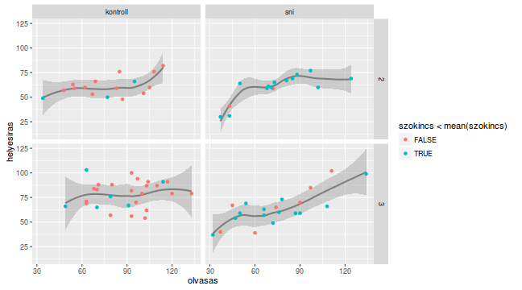
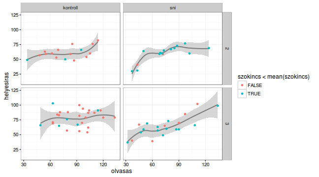
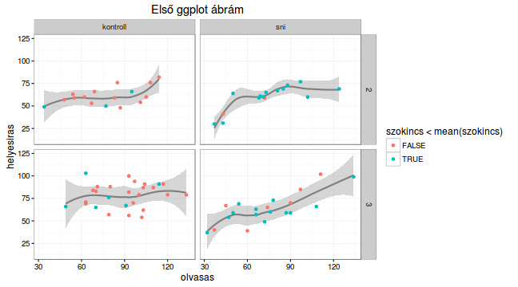

# ggplot2 

A ggplot2-vel gyakorlatilag publikációs minőségű ábrát készíthetsz néhány 
sornyi gépeléssel. A csomag [honlapja](http://ggplot2.org/) és az ott 
feltüntetett linkek, illetve [ez](http://www.cookbook-r.com/Graphs/) az 
internetes segédlet jó kiindulási alapot adnak, valamint érdemes megnézni [ezt a gyűjteményt](http://shiny.stat.ubc.ca/r-graph-catalog/) is, amelyen az 
ábrát és az azt generáló kódot is tanulmányozhatod.

A ggplot2 másféle logikát követ, mint a base graphics vagy a lattice,
tulajdonképpen Leland Wilkinson "The Grammar of Graphics" könyvének 
R-implementációja. 

Ha az interneten keresgélsz, sok olyan példára bukkanhatsz, amely a ggplot2
`qplot` függvényét használja. A `qplot` függvény előnye, hogy felhasználói
szemmel hasonlít a base graphics `plot` függvényéhez. Mégis azt javaslom,
SOHA NE használd a `qplot` függvényt, mivel éppen azt veszíted el a ggplot2-ből,
ami a lényege, a sajátos nyelvtant. Ez a sajátos nyelvtan egyébként rendkívül
elegánssá és rugalmassá teszi a ggplot-ot, de sajnos sokkal lassabbá is. Ha
rengeteg adatpontot akarsz megjeleníteni, a base graphics vagy a lattice 
előnyösebb választás.

Egy ggplot ábra tulajdonképpen layer-ekből áll, ahol minden egyes `layer` 
tartalmaz egy `mapping`-et, azaz bizonyos változók leképezését valamilyen
grafikai paraméterré (pl. x vagy y tengely, szín, méret, alak stb.), egy 
`geom`-ot, azaz geometriai alakzatot (pl. pont, vonal, poligon stb.), és egy
esetleges statisztikai transzformációt (pl. egy egyenes lehet az adott 
változókra számolt lineáris regresszió egyenese).

- példa (megegyezik a lattice-példával): az olvasási adatoknál 
maradva ábrázold az olvasási és helyesírási teljesítmény összefüggését a 2-3. 
osztályos gyerekek körében, a vizsgálati csoport és osztályfok szerinti bontásban. Próbálj meg egy simításos görbét is megjeleníteni, amelyik mutatja a két változó összefüggését. Bónusz: ábrázold eltérő színnel az átlag alatti szókincsű gyerekeket.


```r
# adat betöltése
data(dyslex)

# ggplot2 betöltése
library(ggplot2)
```

```
## 
## Attaching package: 'ggplot2'
```

```
## The following objects are masked from 'package:psych':
## 
##     %+%, alpha
```

```r
# ábra elkészítése
gg <- ggplot(subset(dyslex, oszt < 4), 
             aes(x = olvasas, y = helyesiras)) +
    geom_smooth(method = "loess", colour = "grey50") +
    geom_point(aes(colour = szokincs < mean(szokincs))) + 
    facet_grid(oszt ~ csoport)

# ábra megjelenítése
print(gg)
```



```r
# ha nem tetszik a szürke háttér
gg + theme_bw()
```



```r
# ha szeretnéd kiegészíteni címmel is
gg + ggtitle("Első ggplot ábrám") + theme_bw()
```




