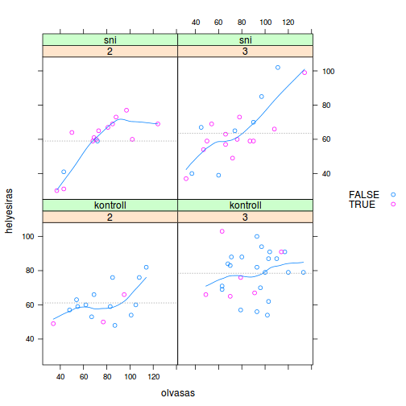

# lattice

A *lattice* a *grid* nevű, alacsony szintű grafikai rendszerre épülő ábrázoló
csomag. A másik, *grid*-re épülő csomaghoz (*ggplot2*) hasonlóan itt nem az
történik, hogy az ábrázoló függvény a megadott grafikai eszközre dolgozik, hanem
maga az ábrázoló függvény csupán egy R adatstruktúrát hoz létre. Ezt utána
ki lehet printelni, azaz egy speciális print függvény jeleníti meg az ábrát a
kívánt grafikai eszközön.

A lattice nagyon klassz akkor, ha feltételes eloszlásokat, kapcsolati mintázatokat 
akarsz megjeleníteni, jellemzően valamilyen kategoriális változó szerinti bontásban. Többnyire olyan formulát kell használni, mintha egy R-es modellt hívnál meg. 


- példa: az olvasási adatoknál maradva ábrázold az olvasási és helyesírási
teljesítmény összefüggését a 2-3. osztályos gyerekek körében, a vizsgálati
csoport és osztályfok szerinti bontásban. Próbálj meg egy nemlineáris görbét
is megjeleníteni, amelyik mutatja a két változó összefüggését. Bónusz: 
ábrázold eltérő színnel az átlag alatti szókincsű gyerekeket.

```r
# adat betöltése
data(dyslex)

# lattice betöltése
library(lattice)

# ábra elkészítése R objektumként
pp <- xyplot(helyesiras ~ olvasas | as.factor(oszt) * csoport, 
             groups = szokincs < mean(szokincs), 
             data = subset(dyslex, oszt < 4),
             auto.key = list(space = "right"),
             panel = function(x, y, ...) {
                 panel.xyplot(x, y, ...)
                 panel.loess(x, y)
                 panel.abline(h = mean(y), col = "grey60", lty = 3)
             })

# az ábra kiprintelése (megjelenítése)
print(pp)
```


