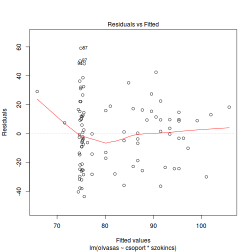
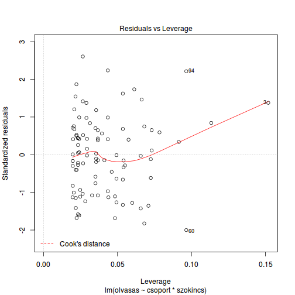

# Ellenőrzés

A modell futtatása után ildomos ellenőrizni, hogy a reziduálisok normál 
eloszlásúak és homoszkedasztikusak-e, illetve hogy nincsenek-e túlzottan
befolyásos megfigyelési egységek a mintában.


- egy egyszerű módszer:

```r
plot(model)
```



_Tipp_: regressziós modellekhez és ANOVA-hoz erősen ajánlott telepíteni John Fox 
[*car*](https://cran.r-project.org/web/packages/car/index.html) nevű csomagját. Rengeteg hasznos függvényt tartalmaz, többek között reziduálisok diagnosztikájához kapcsolódóakat is.
